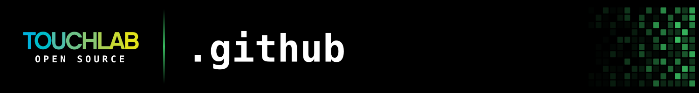

<picture>
  <source media="(max-width: 768px)" srcset="header-narrow.svg">
  
</picture>

## What this repo is

GitHub lets an organization keep one `.github` repository holding files that every other repository
inherits. This is ours. There's no library or tool to install here — if you landed on this repo from
a link in an issue template, a code of conduct, or a contributing guide, this is where that file
lives.

Looking for our tooling? Start with the pinned repositories on the
[Touchlab organization page](https://github.com/touchlab).

## What's inside

| File | What it does |
| --- | --- |
| [`CONTRIBUTING.md`](CONTRIBUTING.md) | How to build, test, and open a pull request against any Touchlab project, and what response times to expect. |
| [`CODE_OF_CONDUCT.md`](CODE_OF_CONDUCT.md) | The Contributor Covenant, applying across our repos and community spaces. |
| [`SUPPORT.md`](SUPPORT.md) | Where to ask for help. |
| [`.github/ISSUE_TEMPLATE/`](.github/ISSUE_TEMPLATE) | Bug report, feature request, and documentation forms, plus the contact links shown when you open a new issue. |
| [`.github/PULL_REQUEST_TEMPLATE.md`](.github/PULL_REQUEST_TEMPLATE.md) | The default pull request checklist. |
| [`profile/README.md`](profile/README.md) | The landing page shown on the [Touchlab organization profile](https://github.com/touchlab). |

Any repository can override any of these by shipping its own copy — a project's own
`CONTRIBUTING.md` or issue templates always take precedence over the defaults here. See
[Using templates to encourage useful issues and pull requests](https://docs.github.com/en/github/building-a-strong-community/using-templates-to-encourage-useful-issues-and-pull-requests)
in the GitHub docs.

## Getting help

- **Bugs and defects** — open an issue on the repository the bug is in, not this one.
- **Questions and "how do I…"** — ask in
  [#touchlab-tools](https://kotlinlang.slack.com/archives/CTJB58X7X) in the Kotlin Community Slack
  ([request access](https://slack.kotlinlang.org/)).
- **Something wrong with these shared files** — that's what this repo's
  [issues](https://github.com/touchlab/.github/issues) are for.

If your team depends on one of our projects and needs a firmer commitment than our open source
response times, [Touchlab Pro](https://touchlab.co/tlpro) covers commercial support.

## Work with us

Touchlab is a mobile development agency focused on modern native mobile accelerated by Kotlin
Multiplatform and AI. We've been shipping KMP in production since before it was stable, and we open
sourced the tooling we needed along the way.

- **Commercial support for our libraries:** [Touchlab Pro](https://touchlab.co/tlpro)
- **Development services:** [touchlab.co](https://touchlab.co)
- **Work here:** [careers](https://touchlab.co/about)
